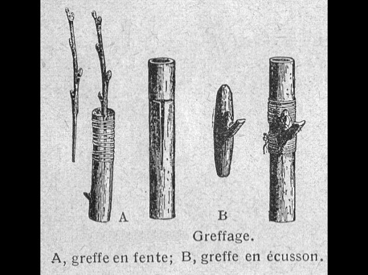
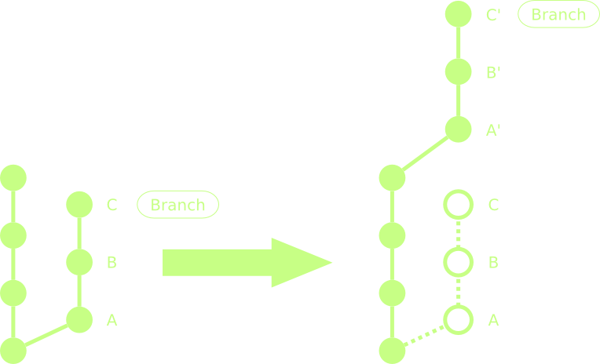

!SLIDE bullets incremental
# GIT better

* Database overview
* Usual commands
* Rebasing
* Tools and advices

!SLIDE bullets incremental
# Database overview

* Repositories
* Commits
* Tags
* Branches

!SLIDE center
# Repositories

!SLIDE bullets incremental
# Repositories

* Complete history (local and remotes)
* Any number of remotes
* Commit offline

!SLIDE center
# Commits

!SLIDE bullets incremental
# Commits

* Unique non-incremental hash id
* Only what's been added (files, lines)
* Mandatory commit message
* Ref to previous commit

!SLIDE center
# Tags

!SLIDE bullets incremental
# Tags

* Label referencing a commit
* Well, that's all it's doing

!SLIDE center
# Branches

!SLIDE bullets incremental
# Branches

* Label referencing a commit
* Can be selected
* Follows progression
* Easy to move around (reset, rebase)

!SLIDE commandline incremental
# Usual commands (1)

Make any directory a git repository
    $ git init
Clone a remote git repository
    $ git clone git://url.to.your/repository.git
Add a file / directory to the upcoming commit
    $ git add file-or-directory
Commit any current changes with a message
    $ git commit -am "Whatever message"

!SLIDE commandline incremental
# Usual commands (2)

Adds current changes to the last commit
    $ git commit --amend -a
Create a branch (starting at current commit)
    $ git branch the-branch
Get to a branch (and set it as current branch)
    $ git checkout the-branch
Get to a specific commit (detached from a branch)
    $ git checkout the-commit-hash-or-tag-name

!SLIDE commandline incremental
# Usual commands (3)

Read current files status (changed, staged, ...)
    $ git status
Read history
    $ git log
Read differences between two commits
    $ git diff first-commit second-commit
Basic GUI
    $ gitk

!SLIDE commandline incremental
# Usual commands (4)

Undo the last commit, keeping changes as if uncommited
    $ git reset HEAD^
Undo the last commit, undoing any changes
    $ git reset --hard HEAD^
Undo current uncommited changes
    $ git reset --hard HEAD
Apply a commit it on top of current branch
    $ git cherry-pick the-commit-hash-branch-or-tag-name

!SLIDE commandline incremental
# Usual commands (5)

Stash current changes
    $ git stash
Apply latest stash
    $ git stash apply
Drop latest stash
    $ git stash drop
Pop (apply then drop) latest stash
    $ git stash pop

!SLIDE commandline incremental
# Usual commands (6)

Update remote informations
    $ git fetch the-remote
Apply changes from a remote branch
    $ git pull the-remote the-branch
Send changes of a local branch to a remote
    $ git push the-remote the-branch
Set a remote branch to a specific commit
    $ git push the-remote the-reference:the-remote-branch

!SLIDE center
# Rebasing

!SLIDE bullets incremental
# Why not just merge ?

* Atomic changes VS. Big diffs
* Branche's author VS. Repository admin
* Topic branches VS. Blurry master
* Readable history VS. Tangle of commits

!SLIDE center
# Rebase effects

!SLIDE commandline incremental
# How to rebase

Start rebasing on a branch
    $ git rebase the-branch

No conflict ? Lucky you

Conflict ? Edit conflicting files, then
    $ git add conflicting.file
    $ git rebase --continue

!SLIDE bullets incremental
# Tools and advices

* Online
* Gui
* Configuration
* Advice

!SLIDE bullets incremental
# Online

* GitHub [https://github.com](https://github.com)
* Gist [https://gist.github.com](https://gist.github.com)
* Heroku [http://www.heroku.com/](http://www.heroku.com/)

!SLIDE bullets incremental
# Gui

* MacOS:
  * GitX [http://gitx.frim.nl/](http://gitx.frim.nl/)
* Linux:
  * Gitg [http://git.gnome.org/browse/gitg](http://git.gnome.org/browse/gitg)
* Windows:
  * msysgit [http://code.google.com/p/msysgit](http://code.google.com/p/msysgit)
  * TortoiseGit [http://code.google.com/p/tortoisegit/](http://code.google.com/p/tortoisegit/)

!SLIDE commandline incremental
# Configuration

Your references
    $ git config --global user.name "Whoever Youare"
    $ git config --global user.email "whoever.youare@mail.com"

Global ignore file
    $ echo ".DS_Store" >> ~/.gitignore
    $ git config --global core.excludesfile ~/.gitignore

!SLIDE commandline incremental
# Configuration

Color output
    $ git config --global color.branch auto
    $ git config --global color.diff auto
    $ git config --global color.interactive auto
    $ git config --global color.status auto

!SLIDE commandline incremental
# Configuration

Auto-rebase by default
    $ git config --global branch.autosetuprebase always
    $ git config branch.the-branch.rebase true

Default text editor
    $ git config --global core.editor "mate -w"

Merge tool
    $ git config --global merge.tool opendiff

!SLIDE bullets incremental
# Advice

* Keep it atomic
* Make topic branches
* Rebase before merge
* Use fixup! and squash!
* DON'T PANIC
